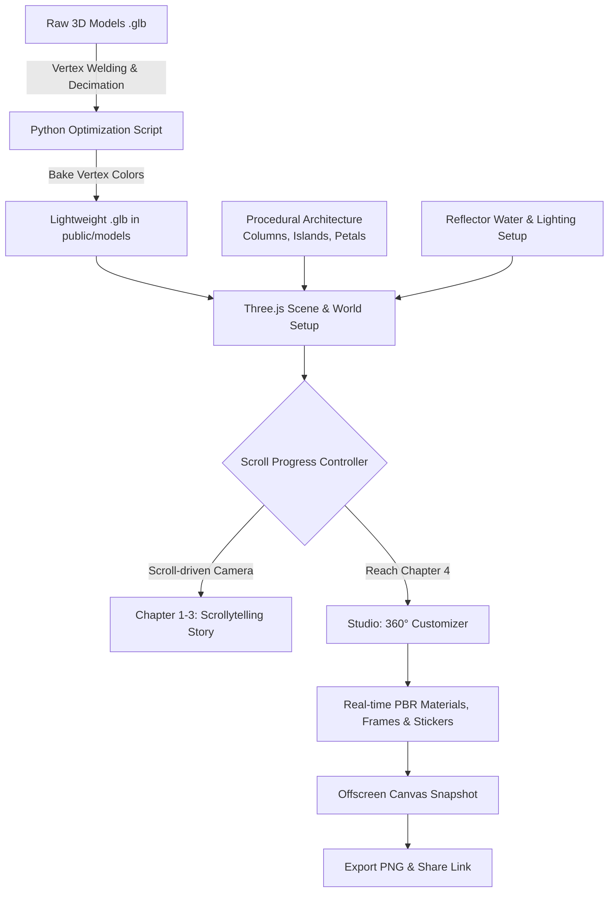

# เอกสารสรุปขั้นตอนการพัฒนาโครงงาน (Project Development Process)
## ระบบเว็บ 3D Interactive Scrollytelling & 3D Model Customizer
**ชื่อโปรเจกต์:** Follow the Star — Tha Rae Stars  
**ประเภทงาน:** Web Application (Interactive 3D / WebGL)  

---

## 1. บทนำและภาพรวมโครงงาน (Project Overview)
โปรเจกต์นี้เป็นเว็บแอปพลิเคชันเชิงโต้ตอบ 3 มิติ (3D Web Interactive) ที่ผสมผสานการเล่าเรื่องตามการเลื่อนหน้าจอ (**Cinematic Scrollytelling**) เข้ากับสตูดิโอปรับแต่งดวงดาว 360 องศาแบบเรียลไทม์ (**Interactive 3D Customizer**) โดยนำเสนอเรื่องราวของเทศกาลแห่ดาวคริสต์มาสท่าแร่ จังหวัดสกลนคร เพื่อสร้างประสบการณ์ที่ดื่มด่ำ (Immersive Experience) ผ่านเว็บเบราว์เซอร์โดยตรง ไม่ต้องติดตั้งโปรแกรมหรือแอปพลิเคชันเพิ่มเติม

---

## 2. เทคโนโลยีที่ใช้ในการพัฒนา (Technology Stack)
* **3D Web Graphics:** [Three.js](https://threejs.org/) (WebGL Library), `GLTFLoader`, `Reflector`, `RoomEnvironment`
* **Frontend Web Core:** HTML5 Semantic Elements, Modern Vanilla CSS3 (Custom Properties & Responsive Design), Modern ES6+ JavaScript
* **3D Optimization Pipeline:** Python (NumPy, Pillow) สำหรับเตรียมและลดทอนข้อมูลโมเดล 3D
* **Build & Dev Tools:** Vite, Node.js Test Runner

---

## 3. ผังขั้นตอนการทำงานรวม (System Workflow Diagram)

---

## 4. รายละเอียดขั้นตอนการพัฒนาระบบ (Development Process)

### ขั้นตอนที่ 1: การเตรียมและปรับปรุงประสิทธิภาพโมเดล 3D (Asset Preparation & Optimization)
โมเดล 3D ทั่วไปมักมีขนาดไฟล์ใหญ่และโพลีกอนหนาแน่นเกินกว่าจะเปิดใช้งานบนเว็บได้อย่างลื่นไหล ทีมงานจึงสร้างกระบวนการเตรียมโมเดลด้วย Python (`prepare-story-models.py`):
1. **Vertex Welding:** ยุบจุดยอดที่อยู่ชิดกันมากให้กลายเป็นจุดเดียว เพื่อลดความซ้ำซ้อนของ Mesh
2. **Decimation & Geometry Simplification:** ลดทอนจำนวนโพลีกอนของโมเดลฉาก (เช่น ฉากถ้ำพระกุมาร, ดาว, ต้นไม้) ให้เหลือโครงสร้างที่จำเป็น
3. **Vertex Color Baking:** แปลงข้อมูลสีจาก Image Texture Map เข้าไปฝังในจุดยอด (Vertex Colors) โดยตรง ทำให้เว็บไม่ต้องดาวน์โหลดไฟล์ภาพ Texture ขนาดใหญ่แยก ลดการใช้ Memory และเพิ่มความเร็วในการโหลดโมเดล (Fast Time-to-Interactive)

---

### ขั้นตอนที่ 2: การสร้างฉาก 3D และระบบแสงเงา (3D Scene Architecture & Lighting)
1. **การตั้งค่า Renderer:**
   * ใช้ `THREE.WebGLRenderer` ร่วมกับ `ACESFilmicToneMapping` เพื่อให้โทนแสงและสีดูนุ่มนวล สมจริง สไตล์ภาพยนตร์
   * เปิดระบบเงา `PCFSoftShadowMap` เพื่อให้ขอบเงามีความฟุ้งละมุน
2. **แสงและสิ่งแวดล้อม (Lighting & Environment):**
   * ใช้ `RoomEnvironment` (PMREMGenerator) จำลองการสะท้อนของสภาพแวดล้อม (Image-Based Lighting) ส่งผลให้พื้นผิวโลหะและกระจกสะท้อนแสงได้อย่างมีมิติ
   * ใช้ `THREE.DirectionalLight` เป็นแสงแดดหลักส่องลงมาจากมุมสูง
   * ตั้งค่า `sun.shadow.bias = 0.0001` และ `sun.shadow.normalBias = 0.02` เพื่อขจัดปัญหาเงาแตก (Shadow Acne) บนแนวขอบโมเดล
3. **พื้นผิวน้ำสะท้อนเงา (Reflection Plane):**
   * ใช้ `Reflector` ของ Three.js ในการสะท้อนภาพโมเดลแบบกลับหัวลงมาเสมือนอยู่บนผิวน้ำนิ่งหรือพื้นหินอ่อนขัดมัน
   * เสริมชั้นระนาบหมอก (`haze`) แบบกึ่งโปร่งใส เพื่อให้แสงสะท้อนดูกลืนเข้ากับบรรยากาศโดยรอบ

---

### ขั้นตอนที่ 3: ระบบเล่าเรื่องตามการเลื่อนหน้าจอ (Scroll-Driven Cinematic Storytelling)
1. **การคำนวณตำแหน่ง Scroll:**
   * ตรวจจับตำแหน่งการเลื่อนหน้าจอ (`window.scrollY`) แล้วแปลงเป็นค่าความคืบหน้าของบทเรียน (`scrollProgress`) ตั้งแต่ 0.0 ถึง 4.0
2. **การเคลื่อนไหวของกล้องแบบ Cinematic:**
   * ใช้ฟังก์ชันการหน่วงทางคณิตศาสตร์ `damp()` ในลูป Render (`requestAnimationFrame`) เพื่อให้กล้องเคลื่อนที่และหมุนมุมมอง (`camera.lookAt`) อย่างนุ่มนวล ไม่กระตุก
3. **การสลับฉากและการมองเห็น:**
   * จัดแบ่งวัตถุในแต่ละบทเป็นกลุ่ม (`modelGroups`) และควบคุมการแสดงผล (`visible`) ตามระยะความคืบหน้า เพื่อประหยัดทรัพยากรการประมวลผล (Culling)

---

### ขั้นตอนที่ 4: สตูดิโอปรับแต่งดวงดาว 3 มิติ (Interactive 3D Customizer)
เมื่อผู้ใช้เลื่อนลงมาถึงช่วงสุดท้ายของหน้าเว็บ ระบบจะเข้าสู่โหมด Studio:
1. **การควบคุมแบบ 360 องศา:**
   * รองรับการลากเมาส์ (Mouse Drag) และการสัมผัสบนหน้าจอมือถือ (Touch Events) เพื่อหมุนและปรับมุมก้มเงยของดวงดาว
2. **Real-time Material Switching:**
   * ผู้ใช้สามารถเลือกสลับเนื้อวัสดุได้แบบเรียลไทม์ เช่น ทอง (Gold), แพลทินัม (Platinum), เงิน (Silver), หินอ่อน (Marble), หรืออัญมณี (Gemstone) โดยเปลี่ยนค่า Metalness, Roughness, Clearcoat และ Transmission
3. **Procedural Lattice Frames & Stickers:**
   * กรอบลายฉลุรอบดวงดาวถูกคำนวณเส้นโครงสร้างด้วยสูตรเรขาคณิต (Mathematical Curves & Tubes)
   * ระบบสติกเกอร์ (Stickers) ใช้ Dynamic Canvas Texture วาดข้อความหรือลวดลายแล้วนำมาสร้างเป็นระนาบ 3 มิติติดบนพื้นผิวดาว

---

### ขั้นตอนที่ 5: ระบบประมวลผลภาพเพื่อส่งออกและแชร์ (Snapshot & Export System)
1. **การบันทึกภาพคุณภาพสูง:**
   * เมื่อผู้ใช้กดปุ่มดาวน์โหลด ระบบจะสั่งให้ WebGLRenderer ทำการวาดภาพขนาดเต็มลงใน Offscreen Canvas
   * ใช้ 2D Canvas Context วาดตัวอักษรและข้อความลงไปบนภาพ
2. **Export & Sharing:**
   * แปลงข้อมูลจาก Canvas เป็นไฟล์รูปภาพ `.png` (Blob) เพื่อให้ผู้ใช้สามารถกดบันทึกรูปผลงานที่ตนเองออกแบบลงในอุปกรณ์ได้ทันที หรือคัดลอกลิงก์ดีไซน์ไปส่งต่อให้ผู้อื่น

---

## 5. การแก้ปัญหาทางเทคนิคสำคัญ (Key Technical Challenges & Solutions)

| ปัญหาที่พบ (Challenge) | สาเหตุ (Root Cause) | วิธีการแก้ไข (Solution) |
| :--- | :--- | :--- |
| **ความหน่วงและการโหลดช้าบนมือถือ** | ไฟล์ 3D และ Texture มีขนาดใหญ่เกินไป | เขียนสคริปต์ Python ทำ Vertex Welding และ Bake สีลง Vertex Colors ทำให้ไม่ต้องโหลดภาพ Texture |
| **รอยเงาเป็นจุดสี่เหลี่ยมดำบนเงาสะท้อน (Shadow Acne)** | ค่า `shadow.bias` เป็นลบ ทำให้โมเดลสร้างเงาทับตัวเอง | ปรับค่า `shadow.bias = 0.0001` และเปิดใช้งาน `shadow.normalBias = 0.02` พร้อมปรับ Texture ของ Reflector ให้คมชัด |
| **การเลื่อนหน้าจอกระตุกไม่เป็นธรรมชาติ** | อัปเดตกล้องตามตำแหน่ง Scroll แบบทันทีทันใด | ใช้ฟังก์ชัน Lerp / Damp เพื่อหน่วงการเคลื่อนที่ของกล้องให้มีความต่อเนื่องและนุ่มนวลแบบภาพยนตร์ |
| **การเรนเดอร์ชิ้นส่วนกรอบดวงดาวหลายชิ้นทำให้ FPS ตก** | แต่ละท่อลายฉลุมี Draw Call แยกกันจำนวนมาก | ใช้ `mergeGeometries` จาก Three.js รวบชิ้นส่วนเรขาคณิตเป็น Mesh เดียวกันก่อนเรนเดอร์ (Batching) |

---

## 6. สรุปผลการดำเนินงาน (Conclusion)
โปรเจกต์นี้ประสบความสำเร็จในการนำเทคโนโลยี **WebGL / Three.js** มาผสานเข้ากับงานออกแบบเว็บไซต์สมัยใหม่ ทำให้เกิดเป็นงานวัฒนธรรมดิจิทัลที่มีปฏิสัมพันธ์กับผู้ใช้งานได้สูง (High Interactivity) มีประสิทธิภาพการทำงานที่รวดเร็ว โหลดไว และรองรับการทำงานได้ทั้งบนเครื่องคอมพิวเตอร์และโทรศัพท์มือถือทุกขนาดหน้าจอ
